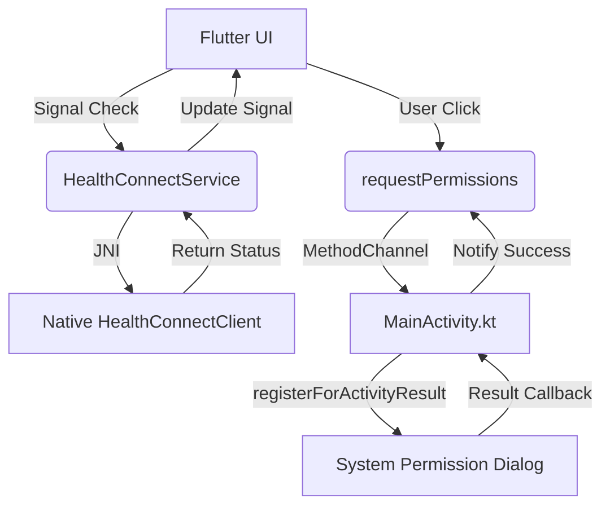

# Health Connect Permission Flow: Technical Architecture

The application uses a hybrid architecture to manage Health Connect permissions, combining **JNI (via `jnigen`)** for state management and **Flutter MethodChannels** for UI-driven permission requests.

## Architecture Overview

The flow is split between checking permission status (read-only operations) and requesting permissions (interactive operations).



## 1. Checking Permissions (Dart to Native via JNI)

The `HealthConnectService._updateConnectionStatus()` method uses `jnigen` bindings to talk directly to the Android Health Connect SDK without a middleman.

### Mechanism
1.  **Context Acquisition**: It retrieves the current activity reference via `jni.Jni.getCurrentActivity()`.
2.  **Client Creation**: It uses the generated `HealthConnectClient.Companion.getOrCreate$1` binding to get a client instance.
3.  **Permission Query**: It calls `pc.getGrantedPermissions()`, which returns a `JSet<JString>`.
4.  **Signal Update**: It checks if the set contains the `READ_BLOOD_PRESSURE` and `WRITE_BLOOD_PRESSURE` strings and updates a Flutter `signal`.

**Why JNI?** This allows for synchronous-like checking of status and direct manipulation of the Health Connect API objects (like `HealthPermission`) from Dart code.

## 2. Requesting Permissions (Dart to Native via MethodChannel)

Requesting permissions involves launching a system activity and waiting for a result. While this *can* be done via JNI (using `registerForActivityResult`), it is highly sensitive to the Android Activity Lifecycle.

### Mechanism
1.  **Dart Trigger**: `HealthConnectService.requestPermissions()` invokes a method on the `'androidx.healthconnect'` channel.
2.  **Native Handler**: In `MainActivity.kt`, the `MethodChannel` handler receives the `"requestPermissions"` call.
3.  **Activity Result Launcher**: The activity uses a pre-registered `registerForActivityResult` launcher:
    ```kotlin
    val requestPermissions = registerForActivityResult(requestPermissionActivityContract) { granted ->
        // Callback logic here
    }
    ```
4.  **Launch**: `requestPermissions.launch(PERMISSIONS)` is called, which suspends the current app and shows the Health Connect permission UI.

**Why MethodChannel?** Native Android components like `ActivityResultLauncher` must be registered before an activity is "started". Handling this interaction natively is more robust against lifecycle events (like the activity being destroyed/recreated while the user is in the permission dialog).

## Implementation Details

### Dart Side (`health_connect_service.dart`)
```dart
Future<void> requestPermissions() async {
  await _channel.invokeMethod('requestPermissions');
  _updateConnectionStatus(); // Refresh status after returning
}
```

### Native Side (`MainActivity.kt`)
```kotlin
MethodChannel(flutterEngine.dartExecutor.binaryMessenger, CHANNEL).setMethodCallHandler { call, result ->
    if (call.method == "requestPermissions") {
        requestPermissions.launch(PERMISSIONS)
        result.success(null)
    }
}
```

## Summary of Benefits
- **Performance**: Status checks are direct and don't require boilerplate `MethodChannel` mapping for every query.
- **Reliability**: Interactive permission flows leverage standard Android Activity Result APIs, ensuring the UI flow is handled correctly by the OS.
- **Duality**: Using `signals` on the Dart side ensures that once the native flow completes and updates the status, the UI responds instantly.
